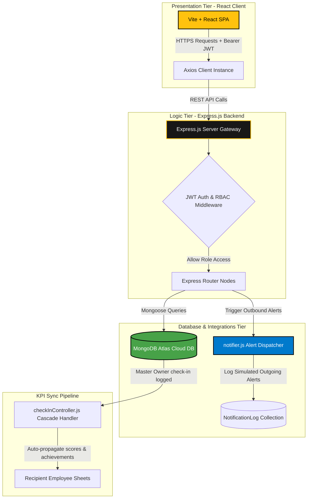

# 📐 Atomberg GoalSync Pro - System Architecture Specification

This document details the software architecture, database layers, and data flow pipelines of the Atomberg GoalSync Pro Portal.

---

## 1. High-Level Architectural Flow (Mermaid Diagram)

The following diagram illustrates how the frontend presentation layer, backend Express controller tier, cloud database cluster, and real-time syncing pipelines interact:

---

## 2. Tier Breakdown & Layer Specs

### A. Presentation Layer (Vite + React Client)
*   **Decoupled Single Page Application (SPA)** using Vite for near-instant compilation and rendering.
*   **State Management**: React Context (`AuthContext`) manages state persistence, maintaining the JWT session across window reloads.
*   **API Interceptor**: Axios instance configured with an request interceptor to automatically attach `Authorization: Bearer <token>` header to all REST requests.
*   **Visualization Engine**: Recharts models render visual analytics showing goal status distribution and check-in score trends.

### B. Business Logic Layer (Node + Express Backend)
*   **Authentication Engine**: JWT signing and verification middleware, handling token parsing.
*   **Role-Based Access Control (RBAC)**: Custom routing middleware (`authorize(['Admin', 'Manager', 'Employee'])`) blocks unapproved requests.
*   **Shared Goal Engine**: Handlers in `goalController.js` and `checkInController.js` calculate dynamic UoM metrics (Min/Max/Timeline/Zero-Based) and cascade check-ins from master owner sheets to recipient sheets in real time.

### C. Storage Layer (MongoDB Atlas Cluster)
*   **Cloud Hosted DB**: Connected to a highly scalable M0 free cluster.
*   **Mongoose Data Schemas**:
    *   `User`: Holds roles (Admin, Manager, Employee), hashed passwords (bcrypt), and personal profiles.
    *   `Goal`: Holds Thrust Area, Title, UoM targets, weightages, completion status, and `sharedFromId` linkages.
    *   `CheckIn`: Records quarter progress, comments, calculated score metrics, and verification file references.
    *   `NotificationLog`: Audit trail of simulated communication dispatches (Email & MS Teams Adaptive Cards).
    *   `AuditLog`: Track governance overrides (locked sheet unlocks) with formal reason tracking.
