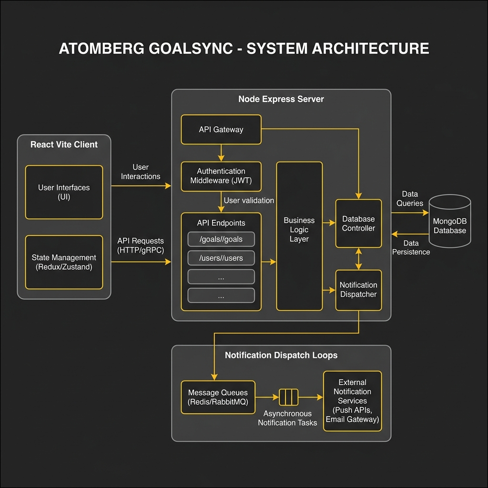

# 👑 Atomberg GoalSync Pro - Enterprise Goal Setting & Tracking Portal

[](https://atomberg-goalsync.vercel.app/)
[](https://github.com/piyushp-07/atomberg-goalsync)

GoalSync Pro is a next-generation **In-House Goal Setting & Tracking Portal** custom-built for Atomberg. It modernizes the employee goal lifecycle, aligns team objectives, automates progress evaluations, and introduces live corporate notification logging and real-time shared KPI propagation.

---

## 🚀 1. Live Hosted Demo Portal
The application is fully hosted and publicly accessible:
*   **Live Portal Link**: [https://atomberg-goalsync.vercel.app/](https://atomberg-goalsync.vercel.app/)
*   **Backend Live API URL**: [https://atomberg-goalsync-api.onrender.com](https://atomberg-goalsync-api.onrender.com)

---

## 🔑 2. Ready-to-Test Credentials (3 Roles)
The production database is fully seeded. For the ultimate ease of evaluation, the login screen includes a **"Quick Switch Journey Panel"** at the bottom—allowing you to click a button and pre-fill credentials instantly! Alternatively, you can log in manually using:

| User Role | Username / Email | Password | Allowed Dashboards & Features |
| :--- | :--- | :--- | :--- |
| **HR Admin** | `admin@atomberg.com` | `admin123` | Cycle shifts, audit logs, locked sheet overrides, propagate shared KPIs, System Notification console. |
| **L1 Manager** | `manager@atomberg.com` | `manager123` | Direct reports review, inline target edits, check-in reviews & feedback, department analytics. |
| **Employee 1** | `employee1@atomberg.com` | `employee123` | Goal formulations draft sheet, weightage balancing (100%), Q1-Q4 check-in logging. |
| **Employee 2** | `employee2@atomberg.com` | `employee123` | Receive propagated read-only shared goals, adjust weightage, log check-ins. |

---

## 📐 3. System Architecture Diagram
The system follows a decoupling-first MERN stack blueprint, incorporating a real-time event dispatcher for outbound automated communications:



### Architecture Stack Layers
1.  **Presentation Tier (Client)**: React.js (Vite), Tailwind CSS (v4), Axios Client, Recharts Engine.
2.  **API Gateway & Controller Tier**: Node.js & Express.js server, custom RBAC authorization middleware.
3.  **Database & Audit Tier**: MongoDB Atlas (Cloud Shared Cluster), Mongoose Object Modeler.
4.  **Integration Tier**: Simulated Notification Dispatcher (Console trace and persistent system logs).

---

## 💎 4. Key Premium Implementations
*   **Shared Goal Propagation & Real-Time Syncing**: HR Admins can define a corporate-level goal (shared KPI) and push it to multiple employees. Recipient sheets lock the title and target to **read-only** (allowing only weightage adjustments). When the primary master owner files a check-in, actual achievement and scoring propagate to all linked sheets instantly!
*   **Universal Outbound Alert Logs Hub**: Trigger-based dispatch engine that logs simulated outgoing Emails and Microsoft Teams Adaptive Cards with deep-links for goal submission, approval, returns, check-ins, feedback comments, and nearing cycle deadlines.
*   **Custom non-technical HR Flow**: HR Admins can perform check-ins against 8 standard HR responsibilities (e.g. Talent Acquisition, Retention) instead of technical metrics, dynamically bypassing scoring and technical targets.

---

## 🛠️ 5. Local Setup & Execution

### Pre-requisites
*   Node.js (v18+)
*   MongoDB Local or Cloud Cluster

### Backend Setup
1.  Navigate to the server directory:
    ```bash
    cd server
    ```
2.  Install dependencies:
    ```bash
    npm install
    ```
3.  Create a `.env` file:
    ```env
    PORT=5000
    MONGO_URI=mongodb://127.0.0.1:27017/goalsync
    JWT_SECRET=supersecretjwtkey_12345
    ```
4.  Seed local database:
    ```bash
    node seed.js
    ```
5.  Start development server:
    ```bash
    npm run dev
    ```

### Frontend Setup
1.  Navigate to the client directory:
    ```bash
    cd ../client
    ```
2.  Install dependencies:
    ```bash
    npm install
    ```
3.  Start development server:
    ```bash
    npm run dev
    ```
    *Access portal at: http://localhost:5173*
